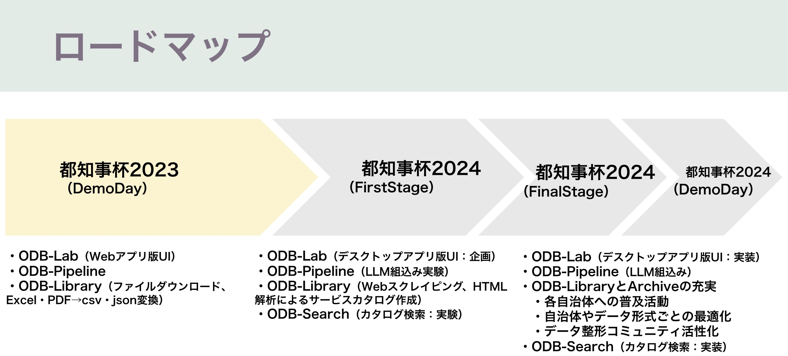

# OpenData Bridge - オープンデータの加工と共有をシンプルに

## 作品概要
- **OpenData Bridge**は、オープンデータの整形・共有をサポートするツール群を提供します。  
- 私達は前回の都知事杯Open Data Hackathon2023で提案したOpenData Bridgeを複数のプロジェクトに実戦投入してきました。
- 今回の都知事杯ではそこで見えてきた課題を解消し、オープンデータ生成・整形の促進と、目的に応じたデータ加工がもっと簡単に行える環境を整えて行きます。

## OpenData Bridgeの実績
- 前回DemoDayまでの実績: [地方公共団体のオープンデータ取組支援ツールの実現可能性調査](https://www.digital.go.jp/budget/entrustment_deliverables)
- 前回DemoDay 〜 今回FirstStageまでの実績: 行政サービスカタログ化PJ（２件）

## 作品構成要素
| 構成要素       | 概要                                                                 | GitHub Repository （前回都知事杯からの差分）                          |  デモ                     |
|----------------|----------------------------------------------------------------------|-----------------------------------------------|------------------------------|
| **ODB-Lab**    | 生成AIによるデータ整形支援のUI |[ODB-App（新規）](https://github.com/dx-junkyard/odb-app) | [このデモ](https://www.youtube.com/watch?v=GrIohSqZYEY&t=5827s)の内容をアプリ化 |
| **ODB-Library**| データ変換のパーツやpipeline定義の登録・共有                               |[ODB-Library（事例追加）](https://github.com/dx-junkyard/OpenData-Library) |  [デモ環境構築](https://github.com/dx-junkyard/OpenData-Library) |
| **ODB-Pipeline**| データ処理のパーツを組合せ、トークン費用を気にせず大量のデータを処理   |[ODB-pipeline（機能追加予定）](https://github.com/dx-junkyard/OpenData-Bridge-pipeline)  |  [デモ環境構築(ODB-Libraryと同じ)](https://github.com/dx-junkyard/OpenData-Library) |
| **ODB-Archive** | データの加工結果を補完、共有                        |[ODB-Archive](https://github.com/dx-junkyard/OpenData-Archive)  | [射水市の人口データ加工結果](https://github.com/dx-junkyard/OpenData-Archive/tree/main/LocalGovData/162116_city_imizu/PopulationData) |
| **ODB-Search** | pipelineで作成したデータ（例：行政サービスのカタログ）の検索  |[ODB-Search（新規）](https://github.com/dx-junkyard/odb-search)  | [ODB-Search](https://github.com/dx-junkyard/odb-search) |

## 実戦投入により見えてきた課題と解消方法
- マルチユーザー管理の開発コスト → デスクトップアプリ化（ODB-App）
- 行政サービスカタログ作成時のサービス概要の完成度　→　LLMをpipelineに組み込むことで自然な日本語で概要生成（ODB-Pipeline）
- 行政サービスカタログ検索のニーズ　→ カタログ検索機能（ODB-Search）の実装
- ツールの導入だけでは解決しないクセのあるデータ整形　→ コミュニティによるサポート

## 作品のロードマップ

## （今回）都知事杯オープンデータ・ハッカソン2023DemoDay発表資料
- [2024/08/29 資料](2024_odh_first_stage.pdf)
- 動画（後日リンク設定）

## （前回）都知事杯オープンデータ・ハッカソン2023DemoDay発表資料
- [2024/03/16 動画](https://www.youtube.com/watch?v=GrIohSqZYEY&t=5723s)
- [2024/03/16 資料](20240316.pdf)

## コミュニティ参加のお誘い
dx-junkyardでは、技術共有やコラボレーションを通じて、互いに学び、支援し合うメンバーを募集しています。一緒に創造性と革新性に満ちた社会の実現に貢献しましょう。
[コミュニティ参加はこちらのフォームから](https://forms.gle/PVW4kYYh53SzbfdbA)

## 連絡先
OpenData Bridgeやデモ動画に関するご質問、その他のお問い合わせはこちらからお願いいたします。
[https://www.dx-junkyard.com/](https://www.dx-junkyard.com/)

